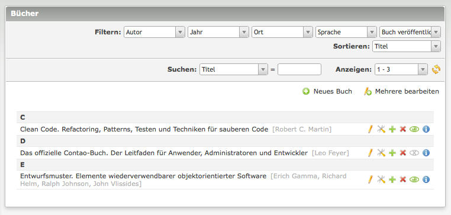
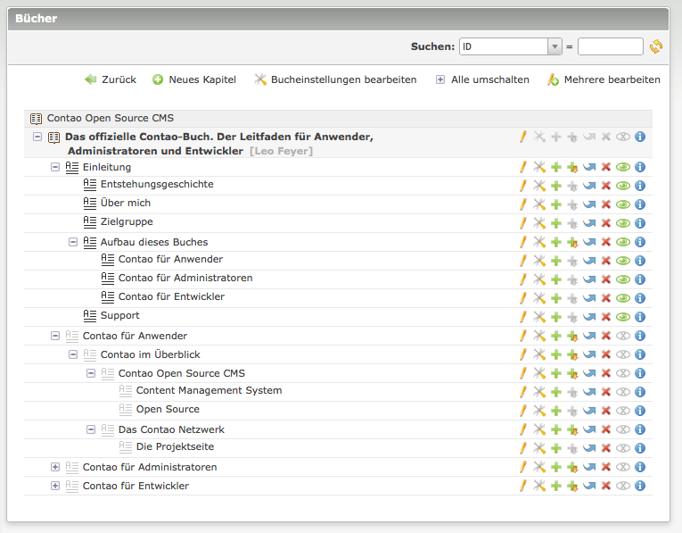

Books Extension für Contao
==========================

Contao bietet die Möglichkeit mit Hilfe des Moduls *Buchnavigation* innerhalb
der Seitenstruktur wie durch ein Buch zu navigieren. Diese Erweiterung geht
einen Schritt weiter und erlaubt es Bücher als eigenständigen Inhalt zu
definieren. Ein Buch definiert Meta-Informationen wie Author und Sprache, und
besitzt eine Kapitelhierarchie. Jedes dieser Bücher kann in Form eines
Inhaltselements in Artikeln auf jeder Webseite einer Contao-Installation
eingefügt werden (multidomainfähig).

Die Erweiterung kann über das
[Contao Extension Repository](https://contao.org/extension-list/view/books.html)
installiert werden.

Verwendung
----------

Hinter dem neuen Menüpunkt *Bücher* unter *Inhalte* werden im Backend die Bücher
verwaltet. Jedes Buch kann beliebig viele Kapitel und Unterkapitel enthalten.
Der Inhalt der Kapitel wird wie bei Artikeln durch Inhaltselemente definiert. 

Innerhalb eines Buches kann mit den folgenden Insertags zwischen den Kapiteln
eines Buches verlinkt werden.

* `{{bookchapter::*}}` Fügt einen Link zu einem Kapitel dieses Buches ein. Der
  Stern * muss durch die ID oder den Alias des Kapitels ersetzt werden.
* `{{bookchapter_open::*}}Click here{{link_close}}` Fügt einen Link zu einem
  anderen Kapitel dieses Buches ein. Der Stern * muss durch die ID oder den
  Alias des Kapitels ersetzt werden.
* `{{bookchapter_url::*}}` Fügt die URL zu einem Kapitel dieses Buches ein. Der
  Stern * muss durch die ID oder den Alias des Kapitels ersetzt werden.
* `{{bookchapter_title::*}}` Fügt den Titel eines Kapitels dieses Buches ein.
  Der Stern * muss durch die ID oder den Alias des Kapitels ersetzt werden.

**Ansicht der Bücher als Liste**

**Ansicht der Kapitel eines Buches als Baum**

