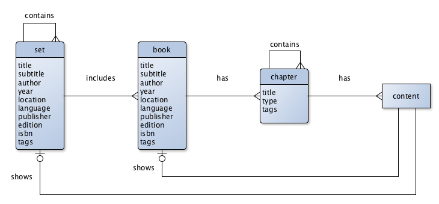

Books Extension für Contao
==========================

A book has several chapters. A chapter may contains other chapters. A chapter
can have every content element provided by Contao.

The content element _book_ shows a book with table of content and navigate through
its chapters.

A set includes one or more books. A book can be included by several sets. A set
may contains other sets.
